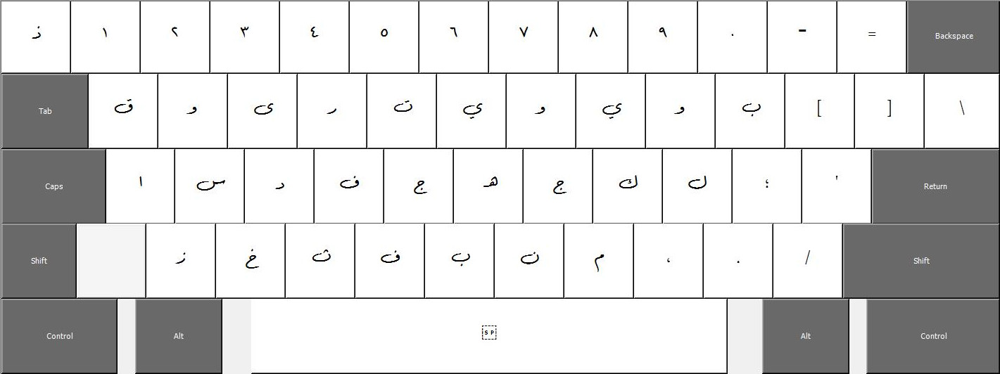

# Improved Arabic Phonetic Layout
The Improved Arabic Phonetic Layout (IAPL) is a custom keyboard layout meticulously designed to enhance the Arabic typing experience for users familiar with transcription systems and phonetics. By using the IAPL, you can directly type in the Latin alphabet, with the layout accurately representing Arabic sounds, making it intuitive and efficient for users accustomed to pronunciation-based input methods. Below are some examples of how the IAPL works:

| Input (Latin) | Output (Arabic) |
| ------------- | --------------- |
| slam          | سلام             |
| ktab          | كتاب            |
| xmr           | خمر             |

## Features 
- **Easy-to-use Phonetic Input:** The layout allows users to input Arabic text using a phonetic approach, enabling a smooth transition from Latin characters to Arabic sounds.
- **Consistent and Intuitive Mapping:** Arabic phonemes are consistently mapped to their closest Latin counterparts, ensuring an intuitive typing experience.
- **Support for Essential Arabic Characters:** The keyboard layout includes essential Arabic letters, diacritics, and numerals, providing specific sounds for accurate representation.

## Layouts

#### Normal Mode

The default mode of the keyboard, where Latin letters are translated to their closest Arabic phonetic counterpart.

#### Shift Mode

In the Shift mask, most letters represent sounds involving guttural sounds, for example, `ت` becomes `ط`, and so on.

#### AltGr (Ctrl+Shift) Mode
.jpg)
The AltGr mode offers access to various diacritic marks, allowing precise representation of Arabic text. Additionally, numbers are extended to include their visual counterparts, for example, `3` becomes `ع`.

## Feedback and Contributions
I welcome any feedback, bug reports, and suggestions for improvements to the IAPL. If you would like to contribute to the project, feel free to open a pull request or submit an issue. Your valuable input helps us continually improve the IAPL and make it a more effective and user-friendly Arabic typing tool.
